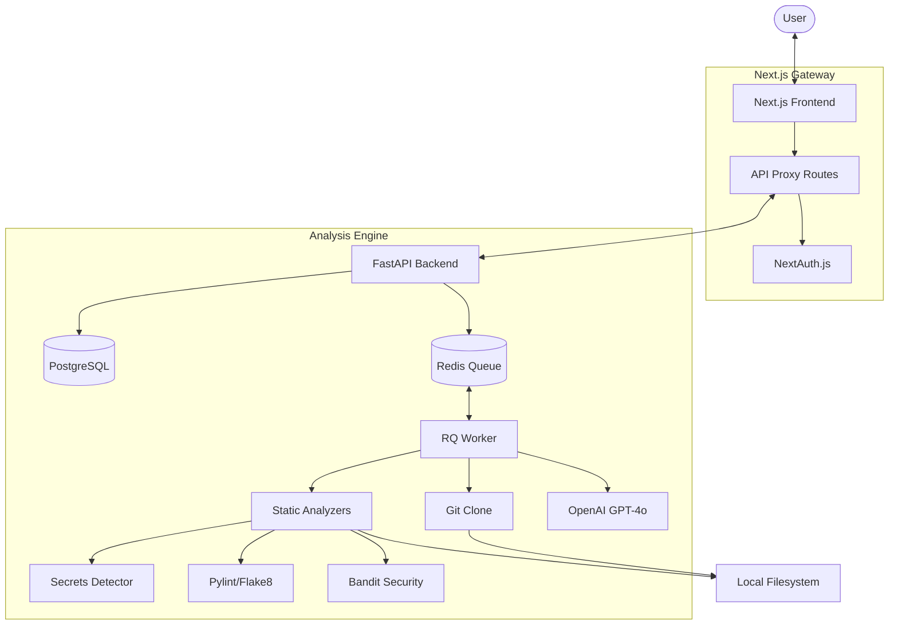

# AI Repository Analyzer 🔍

A professional, production-ready full-stack web application that analyzes public GitHub repositories for code quality, security vulnerabilities, and dependency risks — now with AI-powered insights, visual analytics, and premium reporting.

---

## ✨ Professional Features

- **📊 Visual Analytics Dashboard**: Track issue trends over time with SVG sparklines and interactive metric cards.
- **📄 Professional PDF Export**: Generate clean, print-ready PDF reports for any scan result.
- **🛡️ Multi-Language Secrets Detection**: Beyond Python, we now scan all repositories for leaked AWS keys, GitHub tokens, and private credentials.
- **🔐 Enterprise Security**: Integrated **NextAuth.js** authentication and **Backend Rate Limiting** (`slowapi`) to prevent abuse.
- **⚡ Premium UI/UX**: Shimmer skeleton loaders, global toast notifications, and glassmorphism design system.
- **⌨️ Power User Shortcuts**: Quick navigation with keyboard hotkeys (Press `?` for help).
- **🧪 Continuous Integration**: Automated linting and builds via GitHub Actions.

---

## 🧱 System Architecture



---

## 🚀 Quick Start (Docker)

```bash
# 1. Clone and copy env
git clone <repo>
cd ai-repo-analyzer
cp .env.example .env

# 2. Launch everything
docker compose up --build
```

- **Frontend**: http://localhost:3000
- **Backend API**: http://localhost:8000
- **API Docs**: http://localhost:8000/docs

---

## 🔌 API & Security

### `POST /scan` (Rate Limited: 10/hr per IP)
Submit a GitHub repo for analysis.
```json
{ "repo_url": "https://github.com/psf/requests" }
```

### `GET /scan/{id}/sarif`
Download results in the industry-standard **SARIF** format for integration with security tools like GitHub Code Scanning or SonarQube.

---

## 🎨 Design System (Stitch — Aether Indigo)

- **Background**: `#0d0d18` (deep navy)
- **Primary**: `#bd9dff` (violet)
- **Secondary**: `#53ddfc` (cyan)
- **Style**: Glassmorphism, tonal elevation, and rich micro-animations.

---

## 📋 Roadmap Status

- [x] Multi-language support (Secrets/Configs)
- [x] PDF & SARIF Export
- [x] Trend Analytics & Dashboard
- [x] Rate Limiting & Auth
- [x] Keyboard Shortcuts & Toasts
- [ ] CI/CD Deployment Scripts (In Progress)
- [ ] Team Workspace Support (Planned)

---

## ⚠️ Constraints & Support

- ✅ **Public GitHub repos** only.
- ✅ **Python** is fully supported (Quality/Security/Deps).
- ✅ **All Languages** supported for **Secret Detection** and **AI Code Review**.
- ✅ **Authentication** is now required for dashboard access.
- ✅ **OpenAI key** is recommended for deep fix suggestions.
